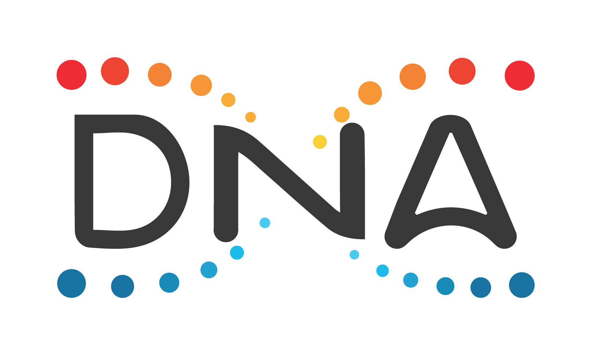

****************************
DNA Developer Portal
****************************

----------

.. centered:: **Welcome to the DNA Developers Portal**

Welcome to the documentation portal for the DNA Blockchain. The content on this page is managed by the DNA community and is constantly improved.

The purpose of this site is to provide in-depth documentation about the DNA Blockchain and make it easier for users and developers to leverage the full power of the DNA Blockchain.

- `DNA.org <https://bitshares.org/>`_
- `DNA Whitepaper <https://github.com/bitshares-foundation/bitshares.foundation/blob/master/download/articles/BitSharesBlockchain.pdf>`_
- `DNA Blockchain Foundation Announcements <http://www.bitshares.foundation/>`_
- `DNA Bug Bounty Program <https://hackthedex.io/>`_
- `DNA Documentation - Users Guide <http://how.bitshares.works/en/latest/>`_
- :ref:`DNA Community <bitshares-communities>`
- `Awesome DNA Blockchain <https://github.com/bitshares/awesome-bitshares>`_
- `DNA News <https://news.bitshares.org/>`_

----------------

DNA Development:  :ref:`Zero to Sixty in 30 Minutes or Less <zero-to-sixty-guide>`

----------------
